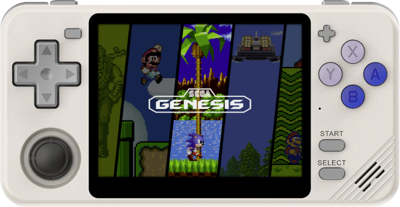

# Powkiddy RGB10X

{ .off-glb }

## Overview






## Controls













## Emulators

- [Platform Documentation (RK3326)](https://github.com/ROCKNIX/distribution/blob/main/documentation/PER_DEVICE_DOCUMENTATION/RK3326)

## Notes

### Installation

Download the latest `RK3326` version of ROCKNIX from the button below and follow the instructions listed on the [Install](../../../play/install/) page.

