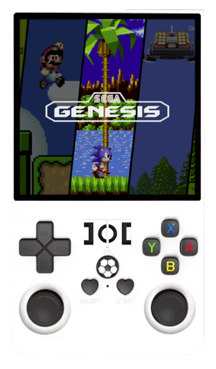

# Game Console R36Max/R36Pro/K36

{ .off-glb }

## Overview






## Controls










## Emulators

- [Platform Documentation (RK3326)](https://github.com/ROCKNIX/distribution/blob/main/documentation/PER_DEVICE_DOCUMENTATION/RK3326)

## Notes

### Installation

Download the latest `RK3326-B` version of ROCKNIX from the button below and follow the instructions listed on the [Install](../../../play/install/) page.

[](https://github.com/ROCKNIX/distribution/releases/latest)
[](https://github.com/ROCKNIX/distribution/releases/latest)

### Other variants with same PCB (K36, R36Pro, R36s clones of year 2025)

Vendor DTBs are very similar, PCBs look very similar too.  
Chances are only display overlay is needed. Try the following instructions and tell us if that worked for you!  

If you have an original `.dtb` file, you can generate a `mipi-panel.dtbo` from it.  
Assuming you have an [SSH](/faqs/#how-do-i-log-in-over-ssh-or-samba) access and you have `scp`'d the original dtb as `rf3536k4ka.dtb`, the process would be as follows:
```console
RK3326:~ # mount -o remount,rw /flash
RK3326:~ # mkdir -p /flash/overlays/
RK3326:~ # ### Be not afraid! importpanel.py may run for a minute or two for some panels
RK3326:~ # /usr/libexec/generic-dsi/importpanel.py rf3536k4ka.dtb -O dtbo -o /flash/overlays/mipi-panel.dtbo
RK3326:~ # sync; mount -o remount,ro /flash/
```
Here we just make an overlays directory writable, then call a script that does all the importing stuff.  
Feel free to run this script on your PC, modify it and experiment with panel timings.  

This script adds a bunch of potentially useful refresh rates, but we have very few knowledge on which modes work well.  
Please check them with `wlr-randr` or with game configuration and tell us which modes work with your panel.
