# :material-layers-plus: Adding Games to ROCKNIX

ROCKNIX has a few options for adding games and the option you choose will depend on the device you have and its available functionality *(For example, some devices do not have networking capabilites so those devices will not be able to use the network transfer option)*.

This page will aim to document all possible options and indicate when you might use a given one over another.

!!! note "For details on which specific files each system requires please see the corresponding pages in the systems section of this wiki."

## Storage Modes

ROCKNIX has support for using internal and external storage (microsd) for games.  To make games available in the OS we provide different features based on the capability of the filesystem that you are using.  To support our storage modes ROCKNIX nests games into a directory on your games card called "roms".  All games found in this path will be available in the OS.

### Merged Storage

When using a microsd that is formatted as Ext4 (Linux), ROCKNIX will present users with the ability to merge both the internal and external storage together allowing users to use both devices to store games.  This mode has two preferences, external (default), and internal.

* Preference External
  * This mode will save anything written to `/storage/roms` to your external microsd (`/storage/games-external/roms`).
* Preference Internal
  * This mode will save anything written to `/storage/roms` to your internal storage (`/storage/games-internal/roms`). 

> Note: *Merged Storage is disabled by default.*

### Simple Storage

When Merged Storage is disabled, or when you are using ExFAT or FAT32, ROCKNIX will mount your external card to `/storage/games-external` and make the content of `/storage/games-external/roms` available at /storage/roms.

### Troubleshooting

* It is possible to create a conflict which will prevent games from being displayed in EmulationStation.  This can usually be resolved by executing `/usr/bin/cleanup_overlay`.  Note: This will reboot your device.
* If no game folders appear in /storage/roms, make sure you have a `roms` directory on your microsd and reboot.

## Option 1: Network Transfer

Network transfer can be used on any device that can connect to the internet (this includes devices with native networking capabilites and ones where networking can be added through an external dongle).

This option first requires you to set up networking on your device.  Please see [Networking](../../configure/networking) for details.  Once you have completed those steps make note of your IP Address in the Network Settings menu.

In addition to your IP you will also need your root password, which is `rocknix` by default.  
You can change it in the Main Menu by pressing ++"START"++ in EmulationStation and navigating to `System Settings`/`Security`.

### HTTP

Enabling Simple HTTP Server in Network settings lets you upload and download files by entering your device's IP address in any browser on the local network (or on VPN IP, see VPN section for details). The username is `root` and the password (`rocknix` by default) can be found in `Root Password` in the Security menu.

### SMB

- Windows:
    - To avoid typing device name/address it is recommended to make your network connection "Private".  
      Windows trusts "Private" connections and shows available shares in "Network".  
      In Settings, open "Network % internet", click on connection's Properties and switch to "Private"
      <details> <summary>Screenshot: Making network Private in Windows</summary>
        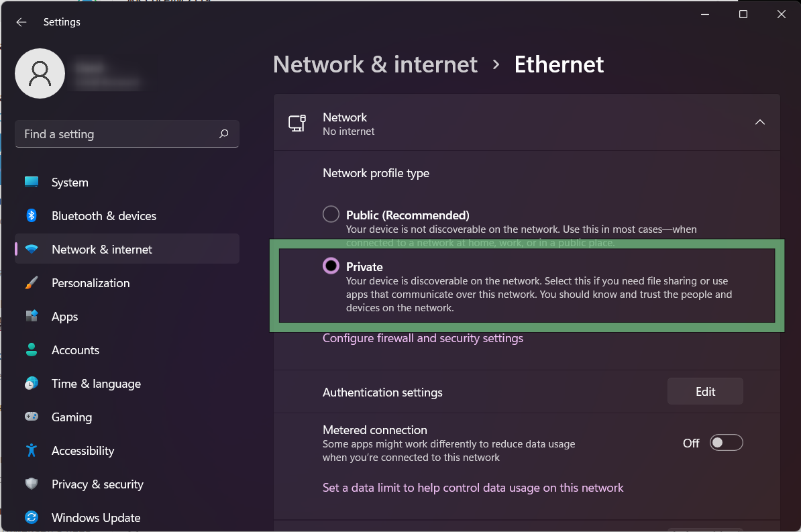
      </details>
    - With "Private" connection you will likely see your device in Windows Explorer's "Network"
      <details> <summary>Screenshot: Handheld in Windows network</summary>
        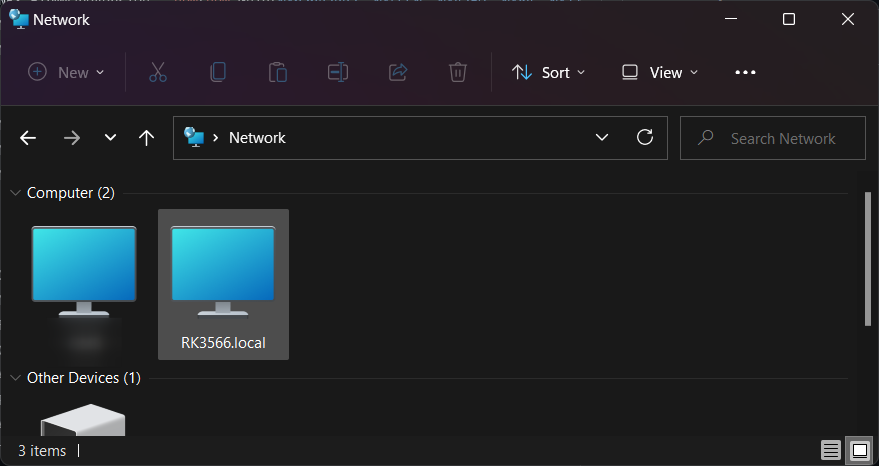
      </details>
    - If you don't see your device (if you chose to stay with "Public" network or if something went wrong) you can access your device by hostname.  
      See (or set as you like) your device hostname in ++"START"++/`Network settings` (let it be `RK3566` as on screenshots).  
      In Explorer address string type `\\[DEVICE HOSTNAME].local` (replace `[DEVICE HOSTNAME]` with proper name) (`\\RK3566.local` on screenshot)
      <details> <summary>Screenshot: Open network share by hostname in Windows</summary>
        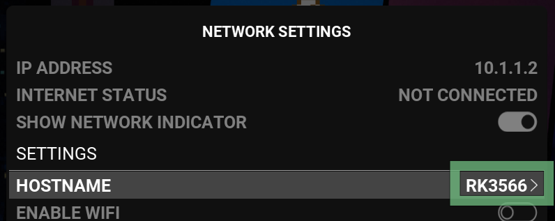
        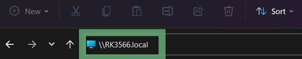
      </details>
    - If event that fails, don't worry. You can access your device by IP address.  
      open a Windows Explorer window, and type in `\\[YOUR IP ADDRESS]`; replace `[YOUR IP ADDRESS]` with the IP Address seen in the Network Settings menu.
    - You may be prompted for a username and password. 
    - The username is `root` and your password (`rocknix` by default) can be found in the `System Settings`/`Security` menu.

- MacOS: 
    - You will likely just see your device in "Shared" section of Finder
      <details> <summary>Screenshot: Handheld in Mac OS Finder</summary>
        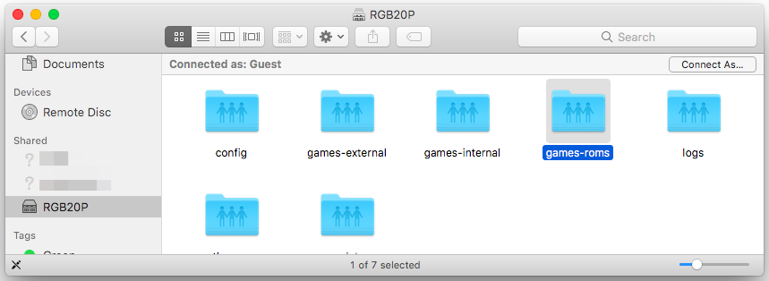
      </details>
    - If that fails, you can connect manually by hostname or IP.  
      Open Finder and press `Cmd`+`K` (or select `Go > Connect to Server` from the top menu).
      In the address bar that appears, type `smb://[ADDRESS]`; replace `[ADDRESS]` with hostname with `.local` suffix or with the IP Address seen in the Network Settings menu.
      <details> <summary>Screenshot: Open network share by hostname in Mac OS</summary>
        
        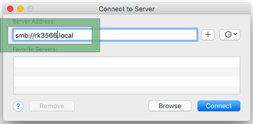
      </details>

    - You may be prompted for a username and password.
    - For name enter `root` and your password (`rocknix` by default) can be found in the `System Settings`/`Security` menu.

### SFTP/SSH

Using your SFTP program of choice; set up an SFTP connection to the IP Address seen in the Network Settings menu.  
Make sure the Port is set to `22`.  
The username is `root` and your password (`rocknix` by default) can be found in the `System Settings`/`Security` menu.

You can also transfer files using the scp command line tool, which is part of OpenSSH and is included with recent versions of Windows and Linux

### After connecting

- You will see a list of folders after you have connected via network.  
- Open the `roms` folder and you will see a list of folders where games and bios files can be placed. *(Please see the systems section of the wiki for details on where each system's files should be placed)*
- After you have added your games you can get them to display in EmulationStation by pressing ++"START"++ to open the Main Menu, then open `Game Settings` then select `Update Gamelists` under the Tools header.

## Option 2: USB Gaget Modes

Many devices can be USB gadgets allowing you to transfer files over USB cable.

- RK3326 has only one data USB port, so you need to connect cable to "OTG" port.  
  Some older Powkiddy devices (ones with wi-fi switch) have built-in USB hub making gadget impossible.
- On other devices use the port you use to charge the console ("DC")

### Network gadget (former ECM)

This mode is most useful. You get a network connection between your PC and console, and then just use Samba or SFTP.

- In EmulationStation's Network Settings: Enable Samba (Windows shares) and/or SSH, switch gadget mode to "network".  
  Don't forget to exit settings to apply changes!
  <details> <summary>Screenshot: Needed options configured</summary>
    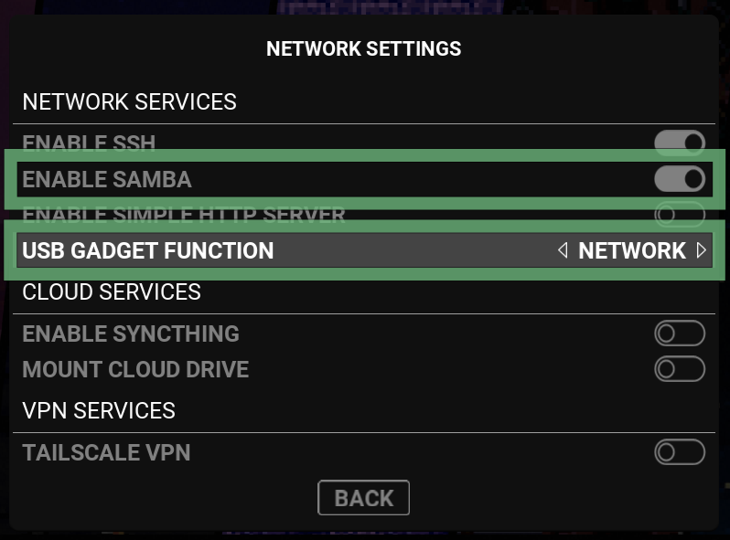
  </details>

- Now your PC should see a new network connection. Check it out in PC's network settings!
  Here "Ethernet 5" with "No internet" is a console gadget connection.  
  Initially Properties will say "Public network".
  <details> <summary>Screenshot: New gadget connection in Windows</summary>
    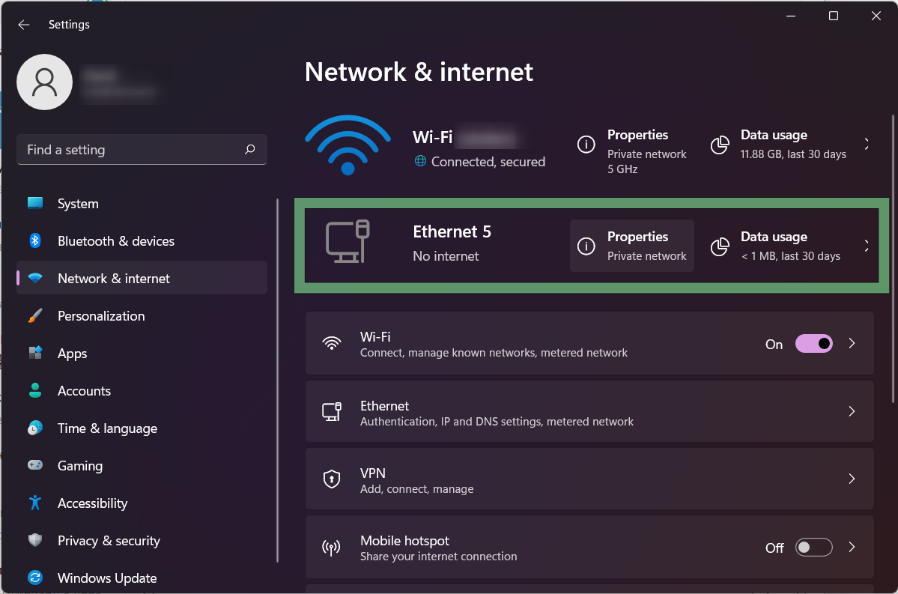
  </details>  

- *Windows only:* You need to change your network profile type to "Private" for easier access.  
  Click on Properties and switch to "Private"
  <details> <summary>Screenshot: Making network Private in Windows</summary>
    
  </details>

- Now, when your PC trusts this connection, you will see your Rocknix device in "Network"
  <details> <summary>Screenshot: Handheld in Windows network and Mac Shares</summary>
    
    
  </details>

- In this "computer" open "games-roms" share.  
  Here you can add roms to corresponding folders.
  <details> <summary>Screenshot: games-roms share in Windows Explorer</summary>
    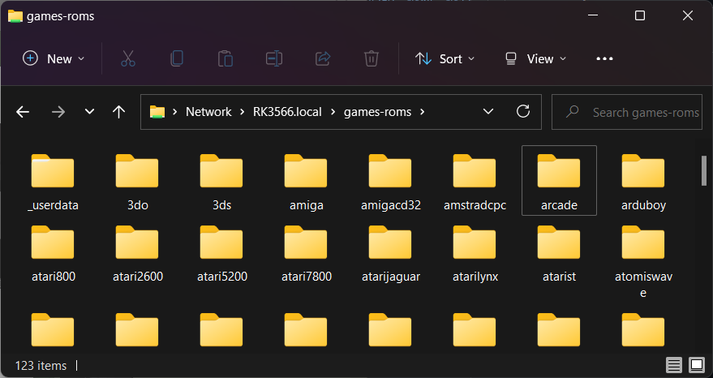
  </details>


### File transfer gadget (former MTP)

This mode seems simple to use, but it has some limitations.

- Some operating systems may need a driver or special software

- Sometimes file transfer fails and you need to restart gadget and retry transfer

- In EmulationStation's Network Settings: switch gadget mode to file transfer.
  <details> <summary>Screenshot: file transfer gadget</summary>
    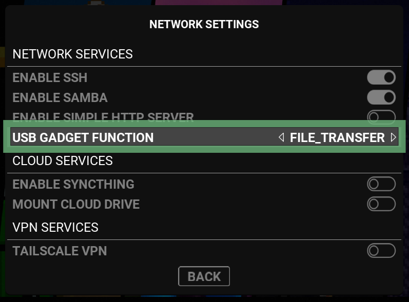
  </details>


## Option 3: SD Card

Games can also be added via an SD card.  There are 2 primary methods for this depending on your device.

### If your device has 2 SD card slots

#### If you *do not* wish to use a second card in Slot 2 for games
- Turn off your device, remove your SD card from slot 1 and open it on your PC.
- You PC will display a list of folders, open the `games-internal/roms` directory and you will see a list of folders for each system where you can place your games and bios files.
- Add your games and place your SD card back into slot 1 and boot up ROCKNIX.

#### If you *do* wish to use a second card in Slot 2 for games
- With your device turned off; insert a FAT32/ExFAT/ext4/btrfs formated SD card into slot 2 of your device.
- Turn your device on.
- When ROCKNIX completes its boot process, create your game directories by selecting the `Create Game Directories` option in `System Settings`.
- Now you can turn off your device, remove your SD card from slot 2 and open it on your PC.
- You PC will display a list of folders, open the `roms` directory and you will see a list of folders for each system where you can place your games and bios files.
- Add your games and place your SD card back into slot 2 and boot up ROCKNIX.

If your device does not see your SD card (or write the needed folders to it) please open `System Settings` and make sure `Autodetect Games Card` is turned on (located under the Hardware/Storage header) then reboot your device.

### If your device has 1 SD card slot

!!! warning "This option is only for devices where you have installed ROCKNIX to the internal drive of the device. In this scenario an SD card can be used directly for storage"

- With ROCKNIX installed to your internal drive press ++"START"++ to open the Main Menu, then open `System Settings` and turn on `Autodetect Games Card` under the Hardware/Storage header.
- Turn your device off
- Insert a FAT32/ExFAT/ext4 formated SD card into your device.
- Turn your device on
- When ROCKNIX completes its boot process, create your game directories by selecting the `Create Game Directories` option in `System Settings`.
- Now you can turn off your device, remove your SD card and open it on your PC.
- You PC will display a list of folders, open the `roms` directory and you will see a list of folders for each system where you can place your games and bios files.
- Add your games and place your SD card back into your device and boot up ROCKNIX.

## Option 3.1: access SD Card in recovery mode

### How to enter recovery mode

- *RK3566 only* Before entering recovery mode, connect handheld to PC via USB
- On other devices you can connect the cable at any time


- On most devices, hold ++"Volume Down"++ while device boots.  
- On SD865 (Retroid Pocket 5/Mini) choose RECOVERY option in GRUB menu
  <details> <summary>Photo: RECOVERY menu entry on RP5</summary>
    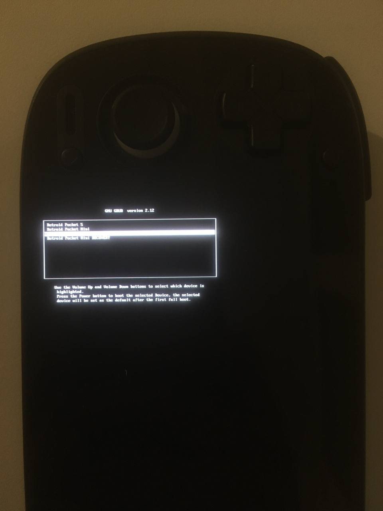
  </details>
- A message will appear telling about exposed SD/eMMC devices
  <details> <summary>Photo: RGB10X exposing both SD cards</summary>
    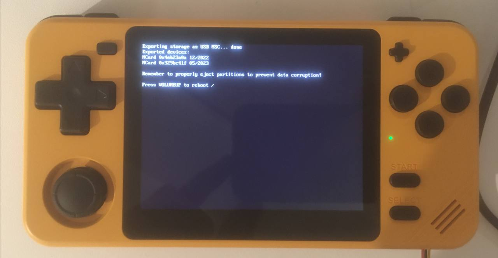
  </details>
- Your PC should now see all your handheld storage devices as USB mass storage
- Manage your ROMs, format partitions or even do a clean ROCKNIX install
- Don't forget to eject all the drives to prevent filesystem corruption
- Press ++"Volume Up"++, device will reboot into normal mode

## Option 4: External USB Drive

ROCKNIX has a built in File Manager and you can use it to access connected USB drives and transfer files. 

1. Connect your USB Drive to your device
2. Open the Tools system and select File Manager
3. Navigate up to `/` and then select `media` - you should see your drive listed after opening media
4. Open your drive and you should see its contents
5. From here you can navigate to the file(s) you would like to copy and then navigate back to the `storage/roms` directory and paste your copied files in the approrpiate folder.

## Option 5: Linux OS

ROCKNIX' storage drive is formated as ext4 which can be read natively by linux operating systems.  Plugging in your SD card into an linux OS will enable you to browse the directories and add files directly.

### NFS Storage

NFS Storage differs to the other approaches in that you do not need to copy any files to the device. It relies on a pre-curated and shared roms location to exist on a Network Attached Storage (NAS) Network File System on the network which the device is connected to. This allows you to quickly load pre-scrapped/existing collections without the need to synchromise or copy anything to an SD card or internal storage.

Unlike SMB/Samba file shares, NFS was designed specifically for fast IO and to work and present like a local file-system to the OS. Using NFS even on 2.4ghz networks for rom collections often provides a better experience than even the internal SD card can support. NFS servers are relatively trivial to setup and can be installed on Windows through the features function.

NFS support in rocknix is implemented as a variation on the merged storage approach. The NFS URI(Universal Resource Identifier) is mounted to /storage/games-external and the local storage is mounted in an overlay as the Upper location. Meaning saves / writes to are kept local to the device. 

To Use NFS create a file in /storage/ called '.nfs-mount' with a single entry of the format:
```NFS_PATH=<valid NFS uri>```

i.e  something similar to 

```NFS_PATH=nfs.example.com:/path/containing-a-roms-subdir```

Once created, ensure you are connected to a Network segment that can reach the NFS URI (local wifi or connected via tailscale/vpn) and navigate to the 'Tools' collection in ES. Execute the 'Mount NFS' entry. ES should restart and you should now have a merged collection available in ES.
