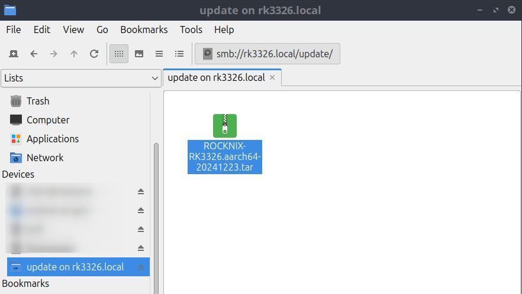

#  :material-update: Updating ROCKNIX

ROCKNIX can be updated "Over the Air" (OTA) or by manually downloading an update .tar file, adding to your device storage and rebooting.

## Option 1: OTA Update

If your device has access to the internet you can update ROCKNIX directly from EmulationStation.

1. In EmulationStation open the main menu by pressing the ++"Start"++ button on your controller.
2. Select `System Settings`
3. Scroll to the `System Update` header and select `Start Update`

!!! info "You can also view the change log for the latest release by selecting the `Change Log` before you update."

## Option 2: Manual Update

If you device does not have access to the internet you can still update manually

1. Download the latest update (.tar) of ROCKNIX for your device from the [releases page](https://github.com/ROCKNIX/distribution/releases/latest).
	* You'll find download links for each device/platform we support under the "`Update Package Downloads`" header.
    * Make sure to download the correct .tar file for your device.  For example; if you are installing ROCKNIX on a [Gameforce Ace](../devices/gameforce/gameforce-ace.md) you would download the `ROCKNIX-RK3588` file.
    * If you have any questions you can check the [Device Support](../devices/index.md) section to confirm which .tar you should download for your specific device.
2. Copy the update to your device's update share.
    * via SCP to `/storage/.update`
      <details> <summary>Snippet: SCP transfer</summary>
      ```shell
      $ scp ~/Downloads/ROCKNIX-RK3326.aarch64-20241221.tar rk3326.local:.update/
      ```
      </details>
    * via Samba to "update"
      <details> <summary>Screenshot: update file copied to "update" samba share</summary>
        
      </details>
3. Reboot the device, and the update will begin automatically.

## Option 3: Development build

!!! warning "Development builds do not contain credentials for scraping and RetroAchievements, so these functions will not work!"

* find a build you need in [dev-builds](https://discord.com/channels/948029830325235753/1250525561823166569) channel
* a link to nightly builds is in channel topic
* `.tar` and `.img.gz` files are good for updating.  
  `.tar` is a bit faster to update than `.img.gz`  
  `.zip` needs to be unzipped  

Update process is similar to manual update:

1. Download (and unzip if needed) the build, you need `.tar` or `.img.gz` file
2. Copy the update to your device's update share.
    * via SCP to `/storage/.update`
      <details> <summary>Snippet: SCP transfer of .img.gz</summary>
      ```shell
      $ scp ~/Downloads/ROCKNIX-RK3326.aarch64-20241221-b.img.gz rk3326.local:.update/
      ```
      </details>
    * via Samba to "update"
      <details> <summary>Screenshot: .tar copied to "update" samba share</summary>
        
      </details>
3. Reboot the device, and the update will begin automatically.
